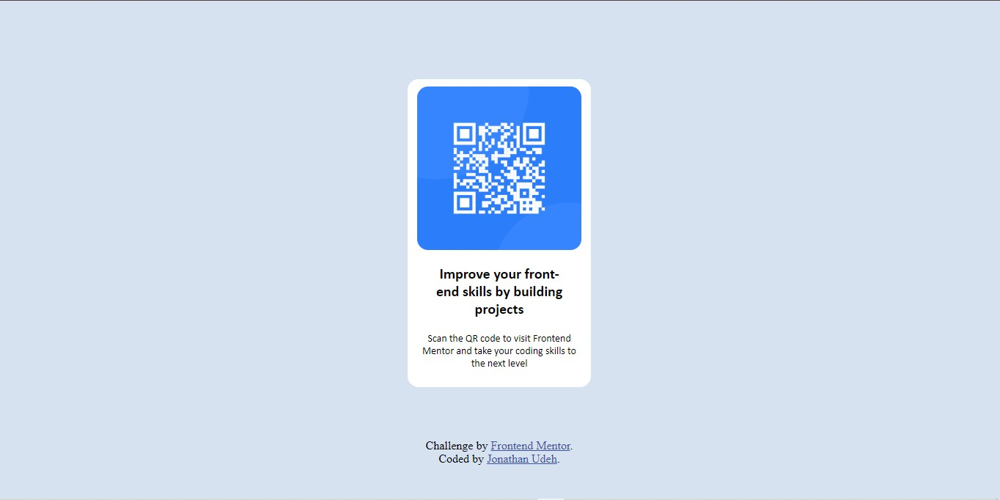

QR Code Component

# Project Overview

This project involves building a QR code component using HTML and CSS, following Frontend Mentors's design and requirements.

### screenshot

## Live Demo
-Live Site url: [Live site url](https://jonathanudeh.github.io/QR-code/)

## Features
- Functional QR code displays correctly
- QR code scales properly
- QR code has correct URL

## Built with
- Semantic HTML5 markup
- CSS custom properties
- CSS Grid
- Mobile-first workflow

## What I learnt
This was my first time working with css grid, but with the help of some online resources like MDN, W3School and some medium and dev community blog post I was able to graspp the basic concept and finish this project. 

## Continued development
I will be using more of css grid layout as well as flexbox so as to get really familiar to them both although my flexbox skills are a lot smoother than that of my grid skill.  

## Author

- Twitter - [@jaywritescodes](https://x.com/jaywritescodes)
- Github - [@jonathanudeh](https://github.com/jonathanudeh)
- Frontend Mentor - [@jonathanudeh](https://www.frontendmentor.io/profile/jonathanudeh)

## Acknoledgement

- Frontend Mentor: Thanks for providing the design and requirements.
